## 1  公众号准备

首先申请一个公众号[申请公众号网页](https://mp.weixin.qq.com/cgi-bin/loginpage?t=wxm2-login&lang=zh_CN)

由于一般的个人订阅号开放的功能有限，作为学习者，我们并不推荐使用这种账号的开发者模式进行开发，而是另外申请一个[测试号](https://mp.weixin.qq.com/debug/cgi-bin/sandbox?t=sandbox/login)进行开发学习，测试号开放的功能基本可以满足我们的学习需求。

默认的测试号登陆进去是这样子的

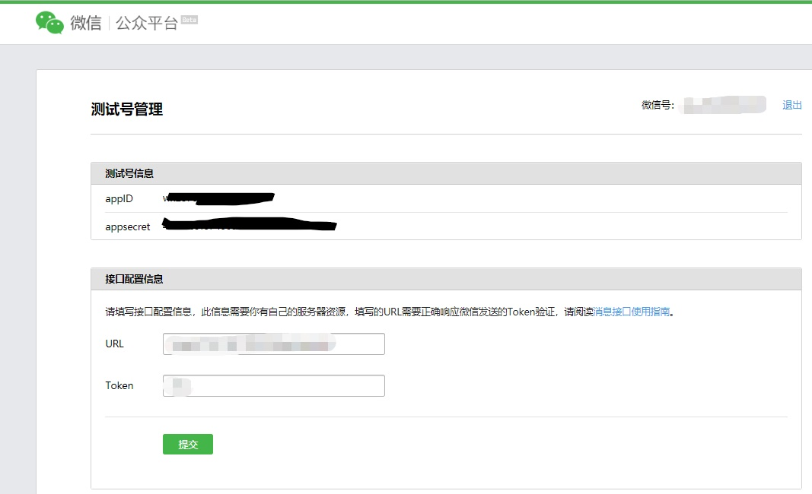


## 2  服务器准备

> 微信开发需要一台具有公网IP的服务器，通常可以使用各种云平台的服务器：如腾讯云，阿里云等，大多数都是收费的，如果仅仅是体验一下，可以使用免费的新浪云sae服务器

### 2.1  新浪sae服务器的申请和使用（仅支持PHP）

****

#### 2.1.1  创建应用

打开官网[https://www.sinacloud.com](https://www.sinacloud.com/)

注册或登录，点击控制台->云应用SAE，点击创建应用


选择空间（运行环境选择标准环境，其他的需要付费）

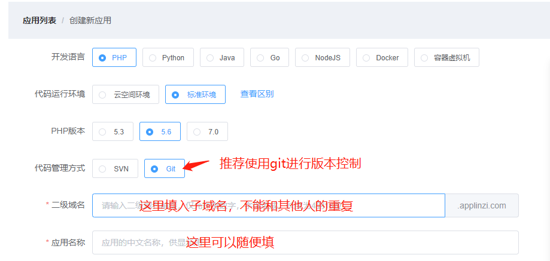

#### 2.1.2  代码管理

在应用列表选择管理

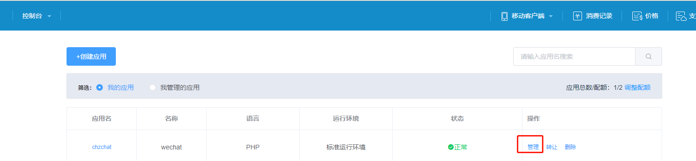

选择运行环境管理，代码管理，创建新版本

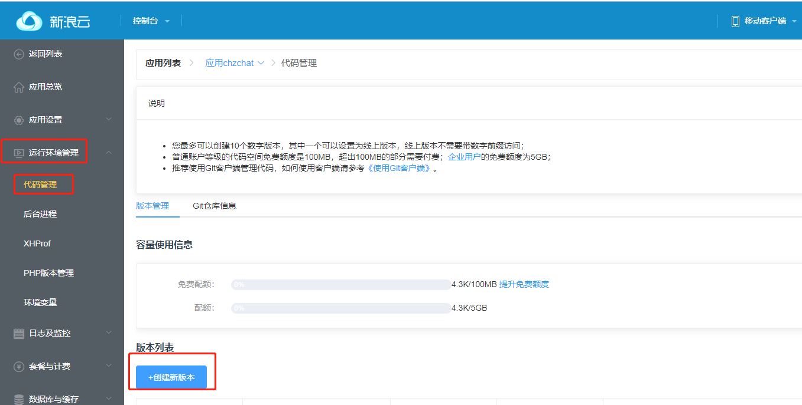

新建完成后可以直接在线编辑代码上传代码包

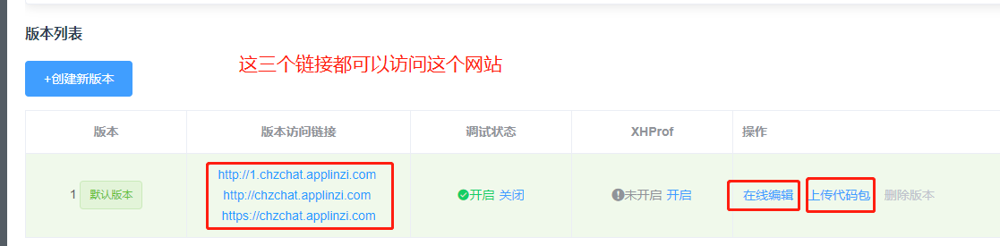

#### 2.1.3  访问测试

创建新版本时默认是没有代码的，故直接访问结果是404

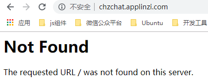


这时可以通过在线编辑或者上传代码包的方式增加代码，比如我在线编辑一个index.html

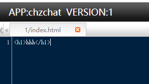

保存之后再访问

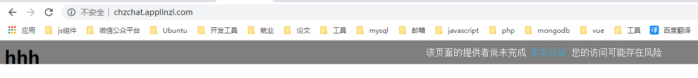

由于还没实名认证，浏览器给出了风险提示，但是我们的代码已经生效了

实名认证可以到新浪云用户中心进行操作

#### 2.1.4  使用git进行代码控制

在新浪云创建新运用后，新浪云默认为我们创建了一个代码仓库，地址：https://git.sinacloud.com/newapp，将newapp换成你的二级域名即可，我们可以将这个代码库克隆下来

示例：

```bash
git clone https://git.sinacloud.com/chzchat
cd chzchat
```

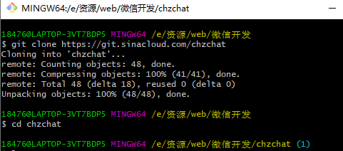

这样我们就可以在这个目录下进行开发，开发完成后使用git命令就可以将代码推送到代码库，代码库是和服务器关联的，这个操作等同于上传代码包，但是更方便，关于git的使用可以参考[廖雪峰老师的教程](https://www.liaoxuefeng.com/wiki/896043488029600)

### 2.2  腾讯云15天免费云服务器

#### 2.2.1  领取免费服务器

[领取地址](https://cloud.tencent.com/act/free?utm_source=portal&amp;utm_medium=verification&amp;utm_campaign=free&amp;utm_term=0521)，首先需要实名认证，这里我选择的操作系统是Ubuntu14

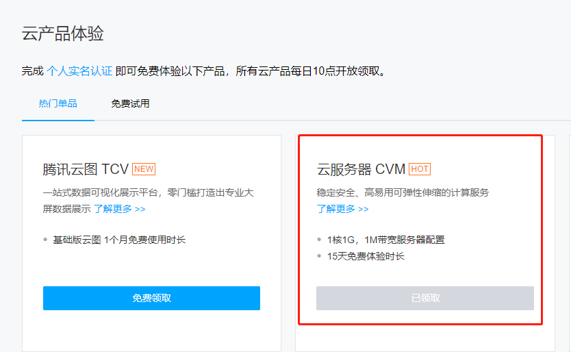

开通后会在控制台的通知那里收到一条信息，里面有操作系统的初始密码，我们可以选择重置密码来设置新密码

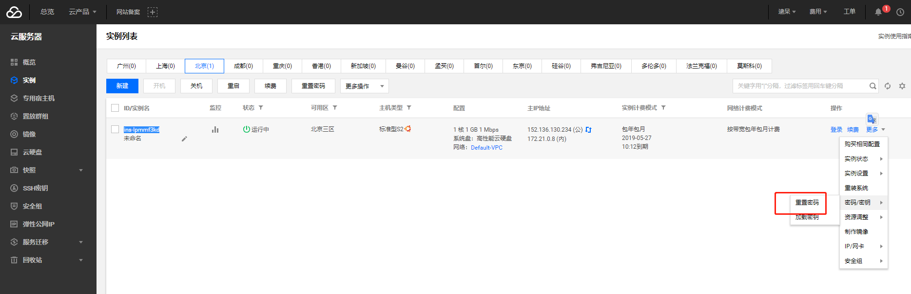

#### 2.2.2  登陆服务器

+ 在浏览器端登陆服务器

    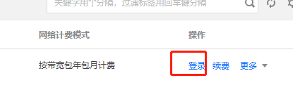

    选择登陆操作，需要微信授权，选择标准登陆模式

    用户名默认为ubuntu，登陆密码为初始密码或重置后的密码，成功登陆

    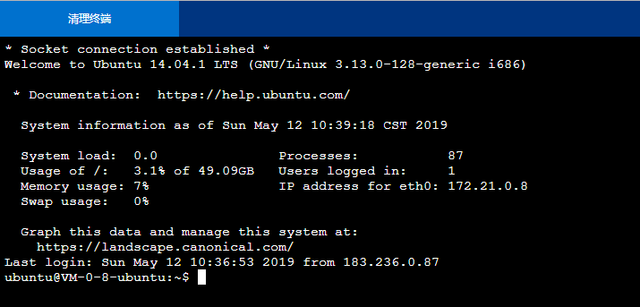

+ 使用xshell登陆

    新建连接

    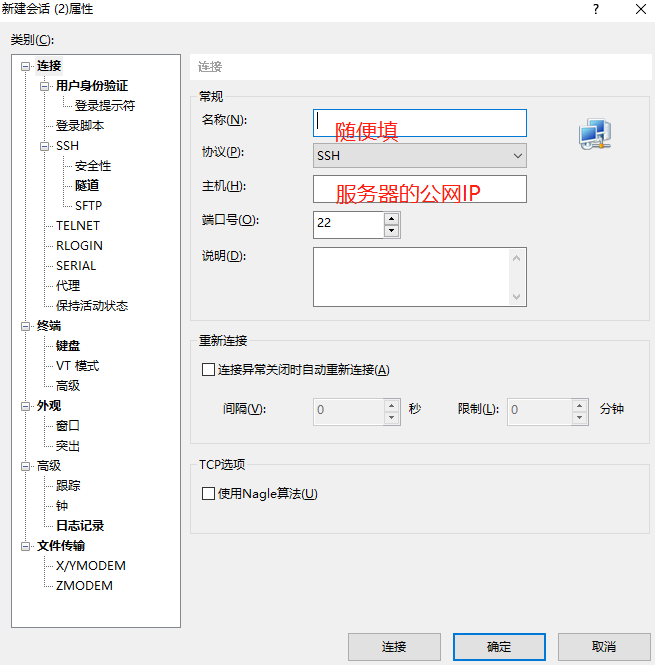

    双击新建立的连接，按提示输入用户名和密码即可成功登陆

    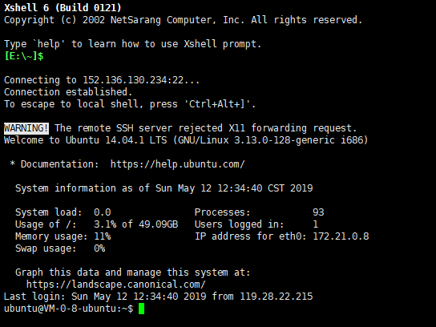

+ 使用xftp登陆

    使用xftp可以在两台计算机之间快速传输文件，连接方式选择sftp，其他操作和xshell基本一致

    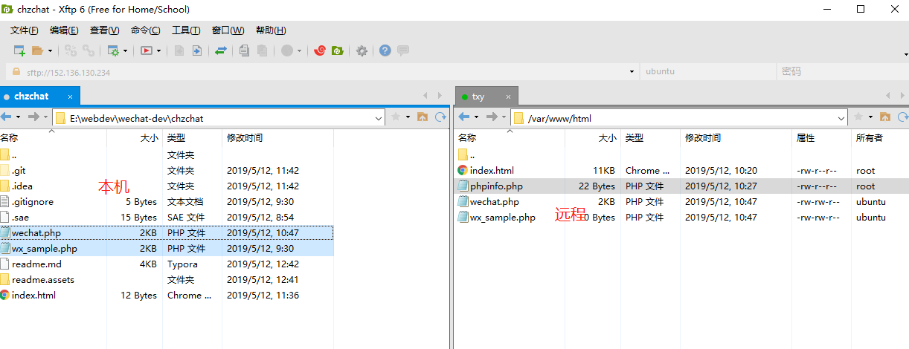

    传输失败的原因可能是Linux的目录没有写入权限，这时我们可以使用xshell先设置好目录权限

    ```bash
    chmod 777 目录名
    ```

+ 使用phpstorm的sftp连接远程代码实现代码实时更新

    首先打开phpstorm的无代码界面，选择关闭当前项目即可打开

    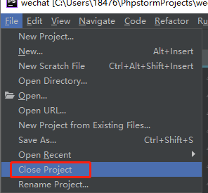

    选择create new project from existing files

    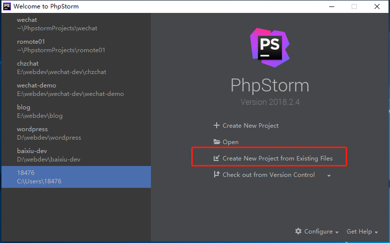

    选择第四个选项，点击下一步

    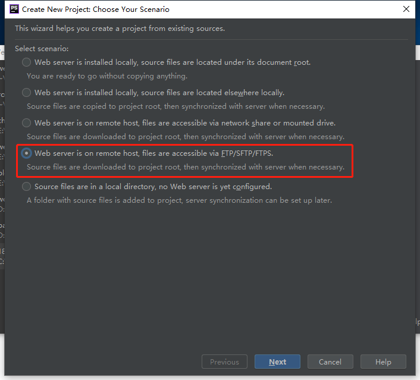

    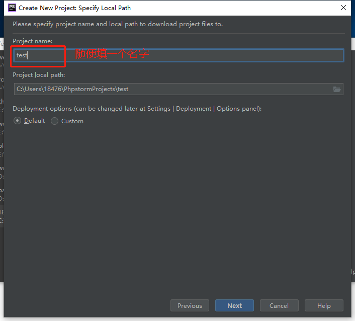

    这里如果没配置过远程主机的话选第一个

    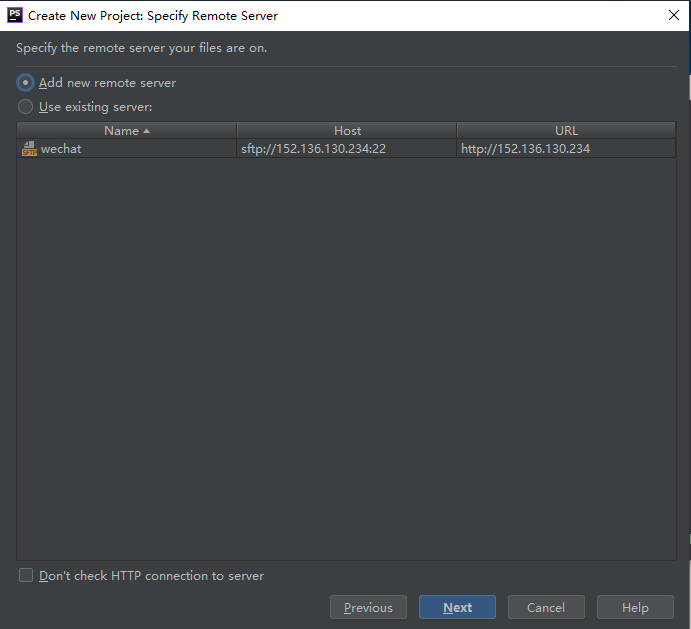

    接下来要配置远程主机，如果上一步选第二个就跳过这一步

    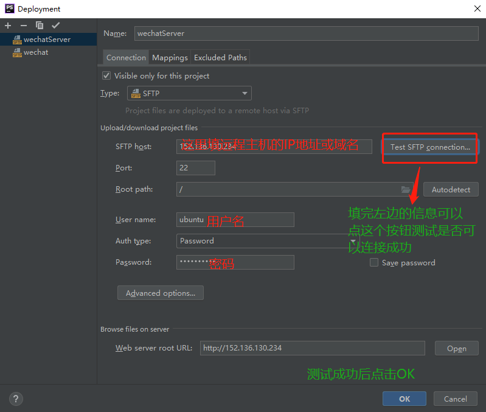

    这里选择远程主机项目根目录，Ubuntu系统一般是/var/www/html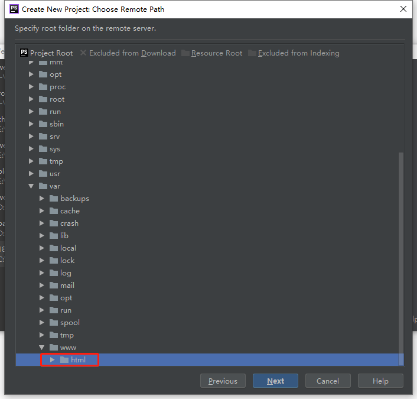

    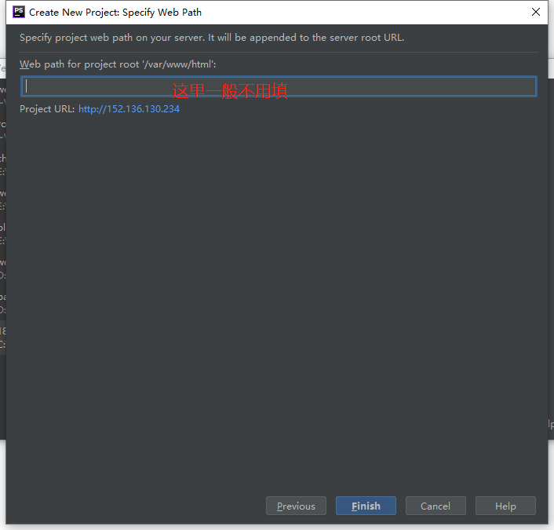

    下载远程主机的文件到本地

    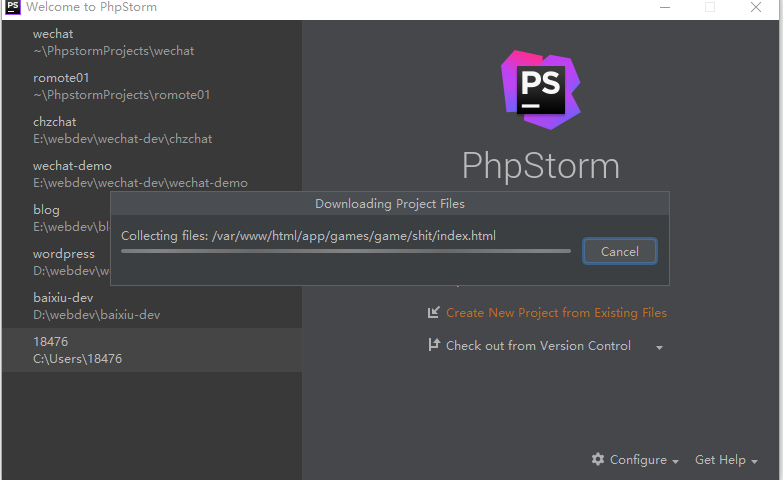

    下载完成后勾选自动提交功能，这样本地代码就会实时更新到远程服务器了

    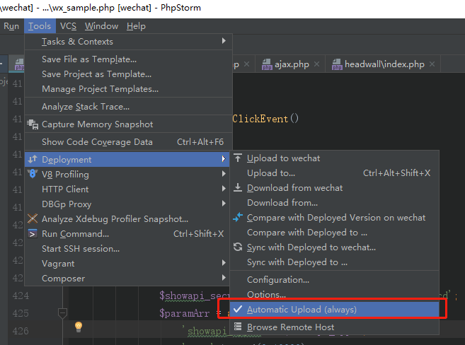

    当然，你也可以手动提交

    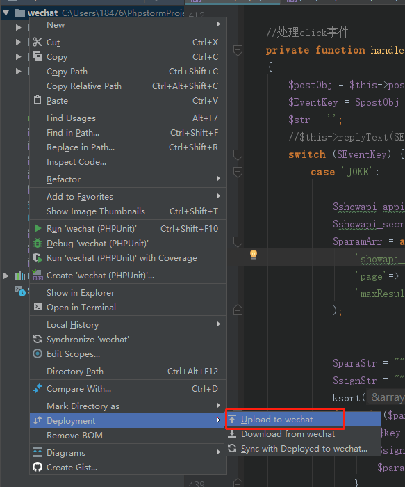


#### 2.2.3  配置开发环境

+ 配置apache2+php5+mysql

    ```bash
    sudo apt-get update
    sudo apt-get install apache2
    sudo apt-get install php5
    sudo apt-get install mysql-server mysql-client
    sudo apt-get install php5-mysql php5-mysqlnd
    #php5-mysql用于开启mysqli扩展
    #php5-mysqlnd用于开启mysqli-fetch-all函数
    ```

    测试apache2是否安装成功

    浏览器访问服务器公网IP

    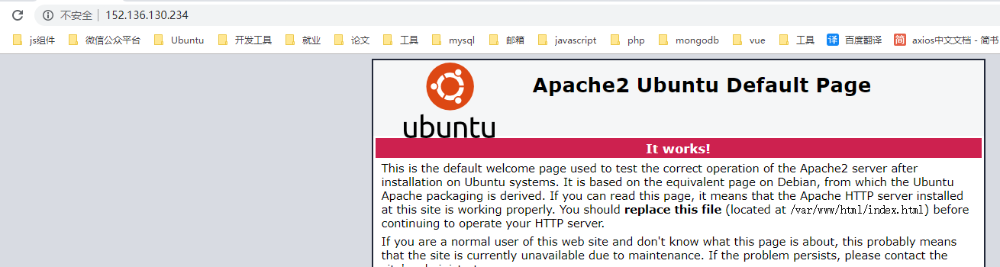

    测试php是否安装成功

    ```bash
    sudo vim /var/www/html/phpinfo.php
    ```

    phpinfo.php内容

    ```php
    <?php
    phpinfo();
    ```

    保存退出编辑，访问phpinfo.php

    

    测试mysql是否安装成功

    ```bash
    #连接数据库
    mysql -uroot -p
    #输入密码
    ```

    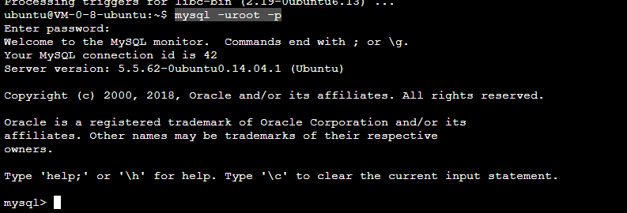

+ Navicat远程连接腾讯云MySQL数据库[解决方法](https://blog.csdn.net/weixin_41471128/article/details/83189083)

+ 其他环境配置请自行百度

## 3  公众号与服务器关联

### 3.1  微信入口文件

在开发目录下新建微信入口文件wx_entrance.php

```php
<?php

define('TOKEN','chz');
$signature=$_GET['signature'];
$timestamp=$_GET['timestamp'];
$nonce=$_GET['nonce'];
$echostr=$_GET['echostr'];

$tmpArr=array(TOKEN,$timestamp,$nonce);
sort($tmpArr,SORT_STRING);
// 拼接字符串 sha1加密
$tmpStr=join($tmpArr);
$tmpStr=sha1($tmpStr);

if ($tmpStr==$signature) {
    echo $echostr;
}else{
    echo "error";
    exit;
}

```

### 3.2  接口配置信息

上传代码到服务器，配置微信测试号接口配置信息

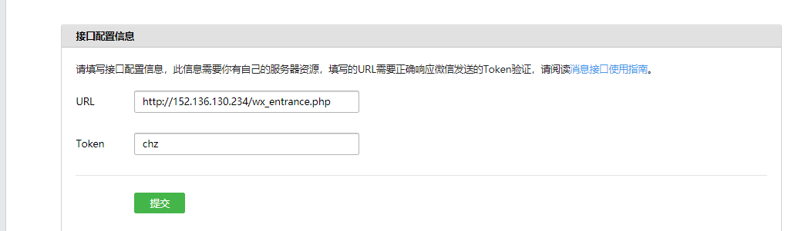

URL填：http://你的服务器公网IP(或域名)/微信入口文件名

Token填微信入口文件中定义的TOKEN，如果信息匹配且服务器器已经实名验证，则提交后提示配置成功


## 4  微信开发小demo——微信消息的接入和消息回复

修改微信入口文件的代码为

```php
<?php

// 加密签名
$signature=$_GET['signature'];
// 时间戳
$timestamp=$_GET['timestamp'];
// 随机出
$nonce=$_GET['nonce'];
// 随机字符串
$echostr=$_GET['echostr'];
// TOKEN
define('TOKEN','chz');
// 字典序排序
$tmpArr=array(TOKEN,$timestamp,$nonce);
sort($tmpArr,SORT_STRING);
// 拼接字符串 sha1加密
$tmpStr=join($tmpArr);
$tmpStr=sha1($tmpStr);
// 加密签名的比较
if ($tmpStr==$signature) {
    echo $echostr;
}else{
    echo "error";
    exit;
}

// 接受xml数据
$postStr = $GLOBALS["HTTP_RAW_POST_DATA"];

if (!$postStr) {
    echo "post data error";
    exit;
}

$postObj=simplexml_load_string($postStr,'SimpleXMLElement', LIBXML_NOCDATA );
$MsgType=$postObj->MsgType;

switch ($MsgType) {
    case 'text':
        $Content=$postObj->Content;
        switch ($Content) {
            case 'hello':
                $xml='<xml>
					<ToUserName><![CDATA[%s]]></ToUserName>
					<FromUserName><![CDATA[%s]]></FromUserName>
					<CreateTime>%d</CreateTime>
					<MsgType><![CDATA[text]]></MsgType>
					<Content><![CDATA[%s]]></Content>
				</xml>';
                echo sprintf($xml,$postObj->FromUserName,$postObj->ToUserName,time(),'欢迎关注');

                break;

            default:
                $xml='<xml>
					<ToUserName><![CDATA[%s]]></ToUserName>
					<FromUserName><![CDATA[%s]]></FromUserName>
					<CreateTime>%d</CreateTime>
					<MsgType><![CDATA[text]]></MsgType>
					<Content><![CDATA[%s]]></Content>
				</xml>';
                echo sprintf($xml,$postObj->FromUserName,$postObj->ToUserName,time(),$postObj->Content);
                break;
        }

        break;
    case 'image':
        $xml='	<xml>
					<ToUserName><![CDATA[%s]]></ToUserName>
					<FromUserName><![CDATA[%s]]></FromUserName>
					<CreateTime>%d</CreateTime>
					<MsgType><![CDATA[image]]></MsgType>
					<Image>
					<MediaId><![CDATA[%s]]></MediaId>
					</Image>
					</xml>';
        echo sprintf($xml,$postObj->FromUserName,$postObj->ToUserName,time(),$postObj->MediaId);
        break;
    default:
        # code...
        break;
}
```

这时我们可以到公众号中发送消息来验证代码

发送"hello"会回复"欢迎关注"

发送其他文字会原样返回

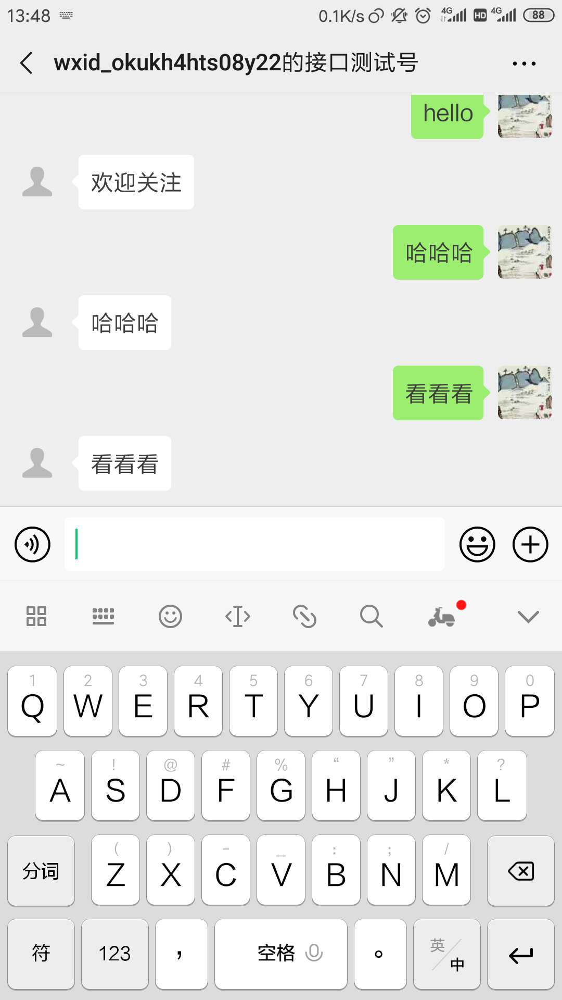


