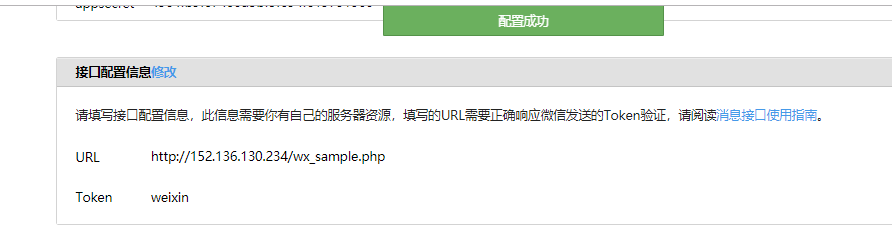
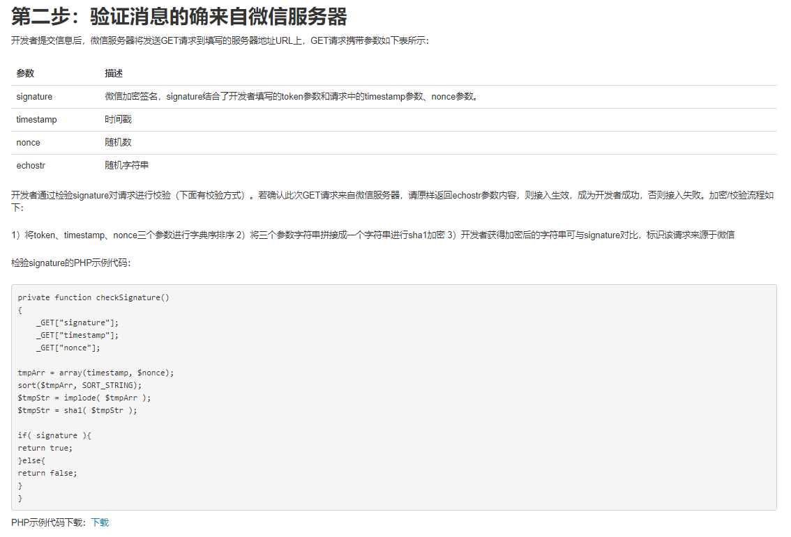
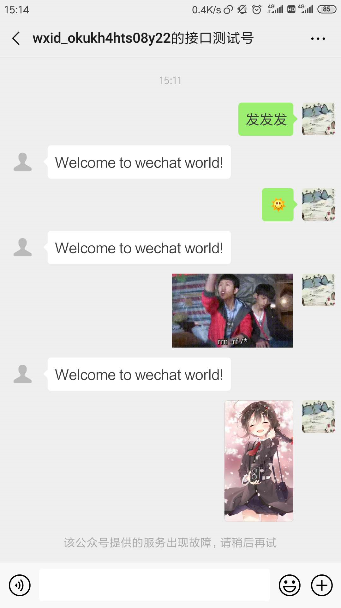
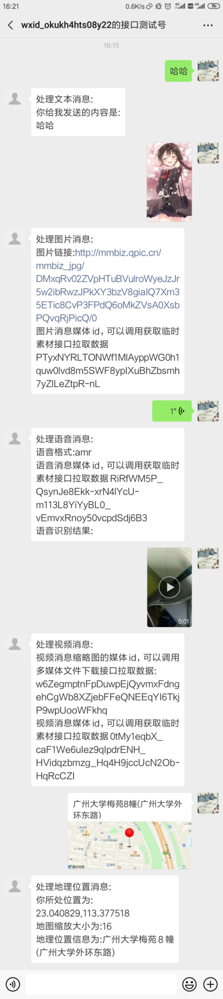
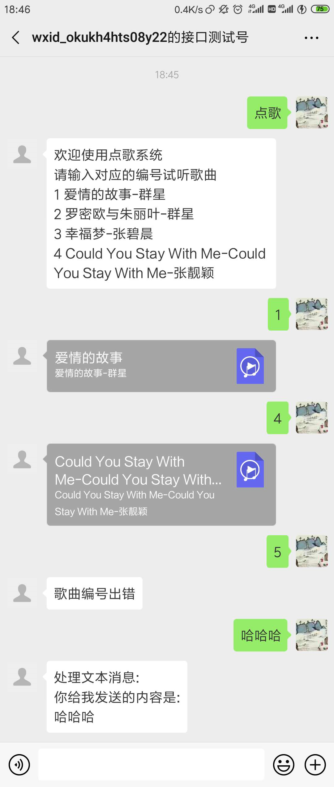
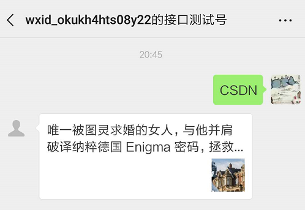
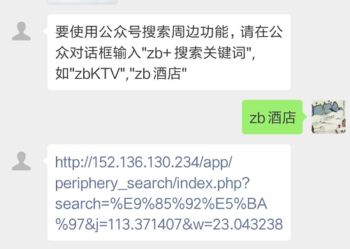
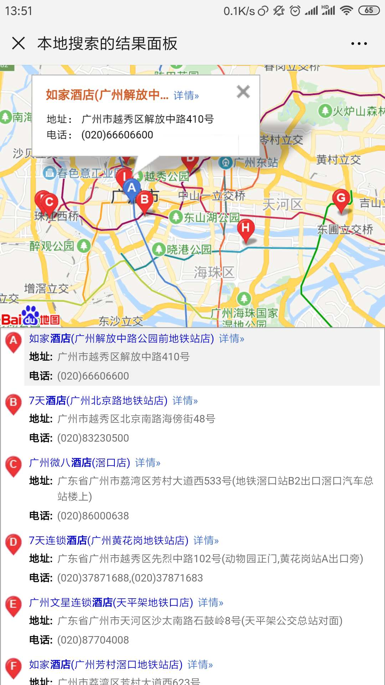

## 1  从wx_sample.php开始

微信官方给开发者提供了[微信公众平台开发文档](https://mp.weixin.qq.com/wiki?t=resource/res_main&id=mp1445241432)

### 1.1  wx_sample.php源码

旧版的微信公众平台开发文档中提供了一个微信入口文件示例wx_sample.php

```php
<?php
/**
  * wechat php test
  * update time: 20141008
  */

//define your token
define("TOKEN", "weixin");
$wechatObj = new wechatCallbackapiTest();
$wechatObj->valid();

class wechatCallbackapiTest
{
	public function valid()
    {
        $echoStr = $_GET["echostr"];

        //valid signature , option
        if($this->checkSignature()){
        	echo $echoStr;
        	exit;
        }
    }

    public function responseMsg()
    {
		//get post data, May be due to the different environments
		$postStr = $GLOBALS["HTTP_RAW_POST_DATA"];

      	//extract post data
		if (!empty($postStr)){
                
              	$postObj = simplexml_load_string($postStr, 'SimpleXMLElement', LIBXML_NOCDATA);
                $fromUsername = $postObj->FromUserName;
                $toUsername = $postObj->ToUserName;
                $keyword = trim($postObj->Content);
                $time = time();
                $textTpl = "<xml>
							<ToUserName><![CDATA[%s]]></ToUserName>
							<FromUserName><![CDATA[%s]]></FromUserName>
							<CreateTime>%s</CreateTime>
							<MsgType><![CDATA[%s]]></MsgType>
							<Content><![CDATA[%s]]></Content>
							<FuncFlag>0</FuncFlag>
							</xml>";             
				if(!empty( $keyword ))
                {
              		$msgType = "text";
                	$contentStr = "Welcome to wechat world!";
                	$resultStr = sprintf($textTpl, $fromUsername, $toUsername, $time, $msgType, $contentStr);
                	echo $resultStr;
                }else{
                	echo "Input something...";
                }

        }else {
        	echo "";
        	exit;
        }
    }
		
	private function checkSignature()
	{
        $signature = $_GET["signature"];
        $timestamp = $_GET["timestamp"];
        $nonce = $_GET["nonce"];
		$token = TOKEN;
		$tmpArr = array($token, $timestamp, $nonce);
        sort($tmpArr, SORT_STRING);
		$tmpStr = implode( $tmpArr );
		$tmpStr = sha1( $tmpStr );
		
		if( $tmpStr == $signature ){
			return true;
		}else{
			return false;
		}
	}
}

?>
```

### 1.2  wx_sample.php源码解读

这个php文件中定义了一个类wechatCallbackapiTest，该类中有三个方法，而整个文件使用了其中的valid方法和checkSignature方法。这两个方法用于验证微信接口配置信息

将wx_sample.php上传至服务器，并修改微信接口配置信息，配置成功



通过阅读微信公众号开发文档->接入指南->第二步



checkSignature方法是接口配置信息验证的主体，而echostr字符串则是是否进行验证的标识，即如果$_GET["echostr"]不为空，则调用vail方法进行验证，否则就可以进行其他操作，如回复消息

修改后的wx_sample.php，完整版见wx_sample01.php

```php
<?php
/**
 * wechat php test
 * update time: 20141008
 */

//define your token
define("TOKEN", "weixin");
$wechatObj = new wechatCallbackapiTest();
if($_GET["echostr"]){
    $wechatObj->valid();
}else{
    $wechatObj->responseMsg();
}
//后面不变
```

这时到公众号发送文本消息（包括纯文字、普通文字表情、动画表情），公众号会回复文本消息“Welcome to wechat world!”，对于其他类型的消息则没有进行处理



参考微信公众号开发文档[消息管理](https://mp.weixin.qq.com/wiki?t=resource/res_main&id=mp1421140453)

可以发现

1. 前四个参数是统一的，所有消息类型都有

    | ToUserName   | 开发者微信号             |
    | ------------ | ------------------------ |
    | FromUserName | 发送方帐号（一个OpenID） |
    | CreateTime   | 消息创建时间 （整型）    |
    | MsgType      | 消息类型，文本为text     |

2. 只有文本消息才有Content参数，这也是为什么responseMsg方法只处理文本消息的原因

### 1.3  改写responseMsg方法

改写responseMsg方法使其能处理所有普通消息类型，完整代码见wx_sample02.php

```php
public function responseMsg()
{
    //get post data, May be due to the different environments
    $postStr = $GLOBALS["HTTP_RAW_POST_DATA"];

    //extract post data
    if (!empty($postStr)){

        $postObj = simplexml_load_string($postStr, 'SimpleXMLElement', LIBXML_NOCDATA);
        $fromUsername = $postObj->FromUserName;
        $toUsername = $postObj->ToUserName;
        $msgType = trim($postObj->MsgType);

        $textTpl = "<xml>
							<ToUserName><![CDATA[%s]]></ToUserName>
							<FromUserName><![CDATA[%s]]></FromUserName>
							<CreateTime>%s</CreateTime>
							<MsgType><![CDATA[%s]]></MsgType>
							<Content><![CDATA[%s]]></Content>
							<FuncFlag>0</FuncFlag>
							</xml>";
        $time = time();
        $repRsgType = 'text';


        switch ($msgType) {
            case 'text':
                $contentStr = "处理文本消息:\n你给我发送的内容是:\n".$postObj->Content;
                break;
            case 'image':
                $contentStr = "处理图片消息:\n图片链接:".$postObj->PicUrl."\n图片消息媒体id，可以调用获取临时素材接口拉取数据".$postObj->MediaId;
                break;
            case 'voice':
                $contentStr = "处理语音消息:\n语音格式:".$postObj->Format."\n语音消息媒体id，可以调用获取临时素材接口拉取数据".$postObj->MediaId;
                //如果开通语音识别
                if($postObj->Recognition){
                    $contentStr .= "\n语音识别结果:".$postObj->Recognition;
                }
                break;
            case 'video':
                $contentStr = "处理视频消息:\n视频消息缩略图的媒体id，可以调用多媒体文件下载接口拉取数据:".$postObj->ThumbMediaId."\n视频消息媒体id，可以调用获取临时素材接口拉取数据".$postObj->MediaId;;
                break;
            case 'shortvideo':
                $contentStr = "处理小视频消息:\n视频消息缩略图的媒体id，可以调用多媒体文件下载接口拉取数据:".$postObj->ThumbMediaId."\n视频消息媒体id，可以调用获取临时素材接口拉取数据".$postObj->MediaId;;
                break;
            case 'location':
                $contentStr = "处理地理位置消息:\n你所处位置为:".$postObj->Location_X.",".$postObj->Location_Y."\n地图缩放大小为:".$postObj->Scale."\n地理位置信息为:".$postObj->Label;
                break;
            case 'link':
                $contentStr = "处理链接消息:\n消息标题为:".$postObj->Title."\n消息描述为:".$postObj->Description."\n消息Url地址为:".$postObj->Url;
                break;

            default:
                $contentStr = "无法处理的消息类型！！！";
        }
        $resultStr = sprintf($textTpl, $fromUsername, $toUsername, $time, $repRsgType, $contentStr);
        echo $resultStr;

    }else {
        echo "";
        exit;
    }
}

```

测试结果（其中小视频和链接消息不知道怎么测试）：




### 1.3  被动回复消息类型

上面程序对所有接收到的普通消息类型做出了回复，且回复的都是文本消息，实际上被动回复用户消息还有其他类型，接下来我们通过案例学习一下其他类型的消息回复

#### 1.3.1  回复音乐消息—实现一个简单的点歌系统

+ 需求介绍：

    ```
    1. 用户在公众号发送“点歌”
    2. 公众号回复一份带链接的歌单
    3. 用户发送歌曲编号
    4. 公众号回复歌曲链接
    5. 不会覆盖掉原来的功能
    ```

    

+ 实现代码见wx_sample_03点歌.php：

    ```php
    class wechatCallbackapiTest
    {
        //定义服务器访问URL
        private $serverUrl = 'http://152.136.130.234';
        //歌曲信息
        private $music = [
            [
                'title' => '爱情的故事',
                'singer' => '群星',
                'url' => '1.mp3'
            ],[
                'title' => '罗密欧与朱丽叶',
                'singer' => '群星',
                'url' => '2.mp3'
            ],[
                'title' => '幸福梦',
                'singer' => '张碧晨',
                'url' => '3.mp3'
            ],[
                'title' => 'Could You Stay With Me-Could You Stay With Me',
                'singer' => '张靓颖',
                'url' => '4.mp3'
            ]
        ];
        private $postObj = null;
        
        //普通消息响应
        public function responseMsg()
        {
            //get post data, May be due to the different environments
            $postStr = $GLOBALS["HTTP_RAW_POST_DATA"];
    
            //extract post data
            if (!empty($postStr)){
    
                $this->postObj = simplexml_load_string($postStr, 'SimpleXMLElement', LIBXML_NOCDATA);
                $postObj = $this->postObj;
                $fromUsername = $postObj->FromUserName;
                $toUsername = $postObj->ToUserName;
                $msgType = trim($postObj->MsgType);
    
                $textTpl = "<xml>
    							<ToUserName><![CDATA[%s]]></ToUserName>
    							<FromUserName><![CDATA[%s]]></FromUserName>
    							<CreateTime>%s</CreateTime>
    							<MsgType><![CDATA[%s]]></MsgType>
    							<Content><![CDATA[%s]]></Content>
    							<FuncFlag>0</FuncFlag>
    							</xml>";
                $time = time();
                $repRsgType = 'text';
    
                switch ($msgType) {
                    case 'text':
                        //封装一个专门处理文本消息的方法handleText并调用
                        $contentStr = $this->handleText($postObj->Content);
                        if(!$contentStr) {
                            $contentStr = "处理文本消息:\n你给我发送的内容是:\n" . $postObj->Content;
                        }
                        break;
                    case 'image':
                        $contentStr = "处理图片消息:\n图片链接:".$postObj->PicUrl."\n图片消息媒体id，可以调用获取临时素材接口拉取数据".$postObj->MediaId;
                        break;
                    case 'voice':
                        $contentStr = "处理语音消息:\n语音格式:".$postObj->Format."\n语音消息媒体id，可以调用获取临时素材接口拉取数据".$postObj->MediaId;
                        //如果开通语音识别
                        if($postObj->Recognition){
                            $contentStr .= "\n语音识别结果:".$postObj->Recognition;
                        }
                        break;
                    case 'video':
                        $contentStr = "处理视频消息:\n视频消息缩略图的媒体id，可以调用多媒体文件下载接口拉取数据:".$postObj->ThumbMediaId."\n视频消息媒体id，可以调用获取临时素材接口拉取数据".$postObj->MediaId;;
                        break;
                    case 'shortvideo':
                        $contentStr = "处理小视频消息:\n视频消息缩略图的媒体id，可以调用多媒体文件下载接口拉取数据:".$postObj->ThumbMediaId."\n视频消息媒体id，可以调用获取临时素材接口拉取数据".$postObj->MediaId;;
                        break;
                    case 'location':
                        $contentStr = "处理地理位置消息:\n你所处位置为:".$postObj->Location_X.",".$postObj->Location_Y."\n地图缩放大小为:".$postObj->Scale."\n地理位置信息为:".$postObj->Label;
                        break;
                    case 'link':
                        $contentStr = "处理链接消息:\n消息标题为:".$postObj->Title."\n消息描述为:".$postObj->Description."\n消息Url地址为:".$postObj->Url;
                        break;
    
                    default:
                        $contentStr = "无法处理的消息类型！！！";
                }
                $resultStr = sprintf($textTpl, $fromUsername, $toUsername, $time, $repRsgType, $contentStr);
                echo $resultStr;
    
            }else {
                echo "";
                exit;
            }
        }
        private function handleText($content)
        {
            $str = '';
            switch ($content) {
                case '点歌':
                    $str = "欢迎使用点歌系统\n请输入对应的编号试听歌曲\n";
                    for($i = 0; $i < count($this->music); $i++){
                        $str .= $i+1 . ' ' . $this->music[$i]['title'] . '-' . $this->music[$i]['singer'] . "\n";
                    }
                    break;
                default:
                    //用正则表达式判断输入的是否是纯数字，如果是纯数字，则将其视为歌曲编号处理
                    if (preg_match('/^\d{1,2}$/', $content)) {
                        $index = (int)$content-1;
                        //当编号不在范围内时提示错误
                        if($index >= count($this->music) || $index < 0){
                            $str = "歌曲编号出错";
                        }else{
                            $data = array(
                                'Title' => $this->music[$index]['title'],
                                'Description' => $this->music[$index]['title']. '-' .$this->music[$index]['singer'],
                                'MusicUrl' => $this->serverUrl . "/music/" . $this->music[$index]['url'],
                                'HQMusicUrl' => $this->serverUrl . "/music/" . $this->music[$index]['url']
                            );
                            //$str = $data['MusicUrl'];
                            //回复一个音乐类消息
                            $this->replyMusic($this->postObj, $data);
                        }
                    }
            }
            return $str;
        }
    
        // 回复音乐消息
        private function replyMusic($postObj,$data){
            $xml="<xml>
                <ToUserName><![CDATA[%s]]></ToUserName>
                <FromUserName><![CDATA[%s]]></FromUserName>
                <CreateTime>%d</CreateTime>
                <MsgType><![CDATA[music]]></MsgType>
                <Music>
                <Title><![CDATA[%s]]></Title>
                <Description><![CDATA[%s]]></Description>
                <MusicUrl><![CDATA[%s]]></MusicUrl>
                <HQMusicUrl><![CDATA[%s]]></HQMusicUrl>
                </Music>
            </xml>";
            echo sprintf($xml,$postObj->FromUserName,$postObj->ToUserName,time(),$data['Title'],$data['Description'],$data['MusicUrl'],$data['HQMusicUrl']);
            exit();
        }
    }
    
    ```

    

+ 测试结果：

    


#### 1.3.2  回复图文消息

+ 需求介绍：

    ```
    1. 用户输入文本消息“CSDN”
    2. 公众号回复CSDN公众号的一条图文消息给用户，比如今天CSDN的推送如下图
    ```

    

    

    首先我们需要获取每一篇文章的封面地址和文章地址，文章地址可以在电脑端使用谷歌浏览器打开文章即可复制，封面地址可以查看文章网页源代码搜索var msg_cdn_url

    开发者只能回复1条图文消息；其余场景最多可回复8条图文消息

+ 实现代码见wx_sample04.php

    ```php
    class wechatCallbackapiTest
    {
        //定义服务器访问URL
        private $serverUrl = 'http://152.136.130.234';
        //歌曲信息
        private $music = [
            [
                'title' => '爱情的故事',
                'singer' => '群星',
                'url' => '1.mp3'
            ],[
                'title' => '罗密欧与朱丽叶',
                'singer' => '群星',
                'url' => '2.mp3'
            ],[
                'title' => '幸福梦',
                'singer' => '张碧晨',
                'url' => '3.mp3'
            ],[
                'title' => 'Could You Stay With Me-Could You Stay With Me',
                'singer' => '张靓颖',
                'url' => '4.mp3'
            ]
        ];
        private $postObj = null;
       
        //普通消息响应
        public function responseMsg()
        {
            //get post data, May be due to the different environments
            $postStr = $GLOBALS["HTTP_RAW_POST_DATA"];
    
            //extract post data
            if (!empty($postStr)){
    
                $this->postObj = simplexml_load_string($postStr, 'SimpleXMLElement', LIBXML_NOCDATA);
                $postObj = $this->postObj;
                $msgType = trim($postObj->MsgType);
    
                switch ($msgType) {
                    case 'text':
                        //封装一个专门处理文本消息的方法handleText并调用
                        $contentStr = $this->handleText($postObj->Content);
                        if(!$contentStr) {
                            $contentStr = "处理文本消息:\n你给我发送的内容是:\n" . $postObj->Content;
                        }
                        break;
                    
                }
                $this->replyText($contentStr);
    
            }else {
                echo "";
                exit;
            }
        }
        private function handleText($content)
        {
            $str = '';
            switch ($content) {
                case '点歌':
                    #···
                    break;
    
                case 'CSDN':
                    $data = array(
                        'Title' => '唯一被图灵求婚的女人，与他并肩破译纳粹德国 Enigma 密码，拯救千万人生命！| 人物志',
                        'Description' => '',
                        'PicUrl' => 'http://mmbiz.qpic.cn/mmbiz_jpg/WnYgQCYvFO0Tm5I9Afc3FzicGs5AppV48BFyan8AHhyjXo1goEQsngWnZ2uXatuVrdnu5yQGYbHfD0UicqiaJXLKA/0?wx_fmt=jpeg',
                        'Url' => 'https://mp.weixin.qq.com/s?__biz=MjM5MjAwODM4MA==&mid=2650720058&idx=1&sn=b8fbe8002ca298d4e2f3842dba27b05b',
                    );
                    //$str = $data[0]['Title'];
                    $this->replyNews($data);
                    break;
    
                default:
                   # ···
            }
            return $str;
        }
    
        //回复图文消息
        public function replyNews($data){
            $postObj = $this->postObj;
    
            $xml="	<xml>
    				<ToUserName><![CDATA[%s]]></ToUserName>
    				<FromUserName><![CDATA[%s]]></FromUserName>
    				<CreateTime>%d</CreateTime>
    				<MsgType><![CDATA[news]]></MsgType>
    				<ArticleCount>1</ArticleCount>
    				<Articles>
    					<item>
                            <Title><![CDATA[{$data['Title']}]]></Title> 
                            <Description><![CDATA[{$data['Description']}]]></Description>
                            <PicUrl><![CDATA[{$data['PicUrl']}]]></PicUrl>
                            <Url><![CDATA[{$data['Url']}]]></Url>
                        </item>
    				</Articles>
    			</xml> ";
    
            echo sprintf($xml,$postObj->FromUserName,$postObj->ToUserName,time());
            exit();
        }
    }
    
    ```


+ 测试结果

    

#### 1.3.3  其他被动回复消息类型会结合后面的内容进行介绍


## 2  处理事件初探

公众号中有以下事件，其中，某些事件推送在发生后，是允许开发者回复用户的，某些则不允许

1 关注/取消关注事件

2 扫描带参数二维码事件

3 上报地理位置事件

4 自定义菜单事件

5 点击菜单拉取消息时的事件推送

6 点击菜单跳转链接时的事件推送

类似普通消息，事件消息也有一个MsgType参数，值为event，我们可以在responseMsg方法中增加一个case来处理事件

下面是处理关注事件时回复一张图片的例子

```php
class wechatCallbackapiTest
{
   
    private $postObj = null;
    

    //普通消息响应
    public function responseMsg()
    {
        //get post data, May be due to the different environments
        $postStr = $GLOBALS["HTTP_RAW_POST_DATA"];

        //extract post data
        if (!empty($postStr)){

            $this->postObj = simplexml_load_string($postStr, 'SimpleXMLElement', LIBXML_NOCDATA);
            $postObj = $this->postObj;
            $msgType = trim($postObj->MsgType);

            switch ($msgType) {
                case 'text':
                    #···
                    break;
                #···
                case 'event':
                    $Event=$postObj->Event;
                    // 处理事件
                    $this->handleEvent($Event);
                    break;

                default:
                    $contentStr = "无法处理的消息类型！！！";
            }
            $this->replyText($contentStr);

        }else {
            echo "";
            exit;
        }
    }
   
    //回复图片
    private  function replyImage($MediaId){
        $postObj = $this->postObj;
        $xml='	<xml>
                    <ToUserName><![CDATA[%s]]></ToUserName>
                    <FromUserName><![CDATA[%s]]></FromUserName>
                    <CreateTime>%d</CreateTime>
                    <MsgType><![CDATA[image]]></MsgType>
                    <Image>
                    <MediaId><![CDATA[%s]]></MediaId>
                    </Image>
                    </xml>';
        echo sprintf($xml,$postObj->FromUserName,$postObj->ToUserName,time(),$MediaId);
    }


    //处理事件
    private function handleEvent($Event)
    {
        $postObj = $this->postObj;
        $str = '';
        switch ($Event) {
            case 'subscribe':
                //关注回复一张图片
                $this->replyImage("ILxDvsbhRRlpmTOTXUbaedhWB3o15_g2AkiifjL5UNMxhHvcYXlofXB_m-DnrUpD");
                break;
            case 'unsubscribe':
                # code...
                break;
            case 'CLICK':
                # code...
                break;
            default:
                # code...
                break;
        }

        return $str;
    }

}

```


## 3  自定义菜单

### 3.1  开启curl扩展：

```bash
sudo apt-get install php5-curl
sudo service apache2 restart
```

### 3.2  获取access_token

**接口调用请求说明**

```
https请求方式: GET
https://api.weixin.qq.com/cgi-bin/token?grant_type=client_credential&appid=APPID&secret=APPSECRET
```

正常情况下，微信会返回下述JSON数据包给公众号：

```
{"access_token":"ACCESS_TOKEN","expires_in":7200}
```

使用curl封装获取access_token方法

```php
private function getAccessToken()
{
    $url="https://api.weixin.qq.com/cgi-bin/token?grant_type=client_credential&appid={$this->appid}&secret={$this->appsecret}";
    $request=$this->httpRequest($url);
    return $request['access_token'];

}
private function httpRequest($url,$data=""){
    // 开启curl
    $ch=curl_init();
    // 设置传输选项
    // 设置传输地址
    curl_setopt($ch, CURLOPT_URL, $url);
    // 以文件流的形式返回
    curl_setopt($ch, CURLOPT_RETURNTRANSFER, 1);
    if ($data) {
        // 以post方式
        curl_setopt($ch, CURLOPT_POST, 1);
        curl_setopt($ch, CURLOPT_POSTFIELDS, $data);
    }

    // 发送curl
    $request=curl_exec($ch);

    $tmpArr=json_decode($request,TRUE);

    if (is_array($tmpArr)) {
        return $tmpArr;
    }else{
        return $request;
    }
    // 关闭资源
    curl_close($ch);
}
```


### 3.3  菜单的创建/删除/查询

注意一点：由于微信缓存的原因，你可能需要取消订阅你原来的微信号后再重新订阅才能看到菜单的效果：

完成代码编写后，访问以下链接即可进行操作，注意将IP地址替换成当前使用的服务器IP或域名

创建菜单链接：<http://152.136.130.234/wx_sample.php?menu=create>

删除菜单链接：<http://152.136.130.234/wx_sample.php?menu=select>

查询菜单链接：<http://152.136.130.234/wx_sample.php?menu=del>

主要改动代码如下，完整代码参考wx_sample06.php

```php
if ($_GET["echostr"]) {
    $wechatObj->valid();
} else {
    if ($_GET["menu"]) {
        switch ($_GET["menu"]) {
            case 'create':
                $data = ' {
     "button":[
     {    
          "type":"click",
          "name":"今日歌曲",
          "key":"V1001_TODAY_MUSIC"
      },
      {
           "name":"菜单",
           "sub_button":[
           {    
               "type":"view",
               "name":"搜索",
               "url":"http://www.soso.com/"
            },
            {
                 "type":"miniprogram",
                 "name":"wxa",
                 "url":"http://mp.weixin.qq.com",
                 "appid":"wx286b93c14bbf93aa",
                 "pagepath":"pages/lunar/index"
             },
            {
               "type":"click",
               "name":"赞一下我们",
               "key":"V1001_GOOD"
            },
			{
				"type": "scancode_waitmsg", 
				"name": "扫码带提示", 
				"key": "rselfmenu_0_0"
			}, 
			{
				"type": "scancode_push", 
				"name": "扫码推事件", 
				"key": "rselfmenu_0_1"
			}
        ]
       },
       {
           "name":"菜单",
           "sub_button":[
           {
				"type": "pic_sysphoto", 
				"name": "系统拍照发图", 
				"key": "rselfmenu_1_0", 
			   "sub_button": [ ]
			 }, 
			{
				"type": "pic_photo_or_album", 
				"name": "拍照或者相册发图", 
				"key": "rselfmenu_1_1", 
				"sub_button": [ ]
			}, 
			{
				"type": "pic_weixin", 
				"name": "微信相册发图", 
				"key": "rselfmenu_1_2", 
				"sub_button": [ ]
			}, 
			{
				"name": "发送位置", 
				"type": "location_select", 
				"key": "rselfmenu_2_0"
			}]
       }]
 }';

                $arr = $wechatObj->menuCreate($data);
                echo "<pre>";
                print_r($arr);
                break;

            case 'select':
                $arr = $wechatObj->menuSelect();
                echo "<pre>";
                print_r($arr);
                break;

            case 'del':
                $arr = $wechatObj->menuDel();
                echo "<pre>";
                print_r($arr);
                break;
            default:
                echo '没有该操作';
        }

    } else {
        $wechatObj->responseMsg();
    }

}


    // 创建菜单
    public function menuCreate($data)
    {
        $url = "https://api.weixin.qq.com/cgi-bin/menu/create?access_token={$this->getAccessToken()}";
        return $request = $this->httpRequest($url, $data);
    }

    // 查询菜单
    public function menuSelect()
    {
        $url = "https://api.weixin.qq.com/cgi-bin/menu/get?access_token={$this->getAccessToken()}";
        return $this->httpRequest($url);
    }

    // 删除菜单
    public function menuDel()
    {
        $url = "https://api.weixin.qq.com/cgi-bin/menu/delete?access_token={$this->getAccessToken()}";
        return $this->httpRequest($url);
    }

```


## 4  处理事件高级

> 不少事件是和菜单功能相关的，因此了解完菜单创建后，我们就可以结合事件处理和菜单实现公众号的一些功能

需求说明：

```
1. 开心一刻：用户点击菜单上的开心一刻按钮，公众号回复一个笑话
2. 游戏中心：用户点击菜单上的游戏按钮，进入公众号游戏中心
3. 关于：用户点击菜单上的关于按钮，公众号回复一条预先准备好的图文消息

```

需求分析：

```
1. 主要是click类型菜单的使用，笑话可以调用网上的api获取
2. 主要是view类型菜单的使用，游戏中心也是使用已有的资源
3. 主要是view_limited类型菜单的使用，因为微信接口有点问题，一直无法获取上传永久图文素材，需求暂时搁置
```


### 4.1  菜单实现

```
{
    "button":[
        {    
            "type":"click",
            "name":"开心一刻",
            "key":"JOKE"
        },
        {  
            "type":"view",
            "name":"游戏中心",
            "url":"http://152.136.130.234/app/games/index.html" 
        }
    ]
}
```

### 4.2  开心一刻

这里选择的是万维易源的[笑话接口](https://www.showapi.com/api/view/341)

主要代码如下（完整代码见wx_sample07.php)：

```php
//处理事件
    private function handleEvent()
    {
        $postObj = $this->postObj;
        $Event = $postObj->Event;
        $str = '';
        //$this->replyText($Event);
        switch ($Event) {
            case 'subscribe':
                //关注回复一张图片
                $this->replyImage("ILxDvsbhRRlpmTOTXUbaedhWB3o15_g2AkiifjL5UNMxhHvcYXlofXB_m-DnrUpD");
                break;
            case 'unsubscribe':
                # code...
                break;
            case 'CLICK':

                $this->handleClickEvent();
                # code...
                break;
            default:
                # code...
                $this->replyText("未处理的事件类型");
                break;
        }

        return $str;
    }

    //处理click事件
    private function handleClickEvent()
    {
        $postObj = $this->postObj;
        $EventKey = $postObj->EventKey;
        $str = '';
        //$this->replyText($EventKey);
        switch ($EventKey) {
            case 'JOKE':

                $showapi_appid = '94899';
                $showapi_secret = 'd8d04dceb5544ca5afec876b035d71cd';
                $paramArr = array(
                    'showapi_appid'=> $showapi_appid,
                    'page'=> rand(0,10000),
                    'maxResult'=> "1"
                );


                $paraStr = "";
                $signStr = "";
                ksort($paramArr);
                foreach ($paramArr as $key => $val) {
                    if ($key != '' && $val != '') {
                        $signStr .= $key . $val;
                        $paraStr .= $key . '=' . urlencode($val) . '&';
                    }
                }
                $signStr .= $showapi_secret;//排好序的参数加上secret,进行md5
                $sign = strtolower(md5($signStr));
                $paraStr .= 'showapi_sign=' . $sign;//将md5后的值作为参数,便于服务器的效验

                $param = $paraStr;
                $url = 'http://route.showapi.com/341-1?' . $param;

                $result = $this->httpRequest($url);
                $this->replyText($result['showapi_res_body']['contentlist'][0]['text']);
                break;

            default:
                # code...
                break;
        }

        return $str;
    }
```


### 4.3  游戏中心

配置好菜单后直接将games文件夹放入服务器根目录下的app文件夹中即可


## 5  案例集训


### 5.1  接入图灵聊天机器人

这里主要通过调用图灵机器人接口来优化公众号回复体验

主要代码（完整代码：wx_sample08.php)

```php
if (preg_match('/^\d{1,2}$/', $content)) {
      #code ···
}else{
    $this->tuLingReply($content);
}

//机器人回复消息
private function tuLingReply($content){
    $url="http://www.tuling123.com/openapi/api?key=c11311dda971ef36a39d2d2f57b86a98&info=".$content;
    // $arr=array(
    // 	"key"=>'c11311dda971ef36a39d2d2f57b86a98',
    // 	"info"=>$Recognition,
    // 	);
    // $json=json_encode($arr);
    $tuArr=$this->httpRequest($url);
    switch ($tuArr['code']) {
        case '100000':
            $this->replyText($tuArr['text']);
            break;
        case '200000':
            $this->replyText("<a href='".$tuArr[url]."'>".$tuArr['text'].'</a>');
            break;

        default:
            # code...
            break;
    }
    exit();
}
```


### 5.2  用户基本信息的应用

> 用户关注公众号时，开发者可以将用户的基本信息存入数据库以备日后使用

#### 5.2.1  获取用户基本信息

新建数据库wechat，然后建立users表

```sql
SET NAMES utf8mb4;
SET FOREIGN_KEY_CHECKS = 0;

-- ----------------------------
-- Table structure for users
-- ----------------------------
DROP TABLE IF EXISTS `users`;
CREATE TABLE `users`  (
  `id` int(11) NOT NULL AUTO_INCREMENT,
  `openid` varchar(255) CHARACTER SET utf8mb4 COLLATE utf8mb4_general_ci NOT NULL,
  `nickname` varchar(255) CHARACTER SET utf8mb4 COLLATE utf8mb4_general_ci NOT NULL,
  `sex` tinyint(2) NOT NULL COMMENT '用户的性别，值为1时是男性，值为2时是女性，值为0时是未知',
  `country` varchar(255) CHARACTER SET utf8mb4 COLLATE utf8mb4_general_ci NULL DEFAULT NULL,
  `province` varchar(255) CHARACTER SET utf8mb4 COLLATE utf8mb4_general_ci NULL DEFAULT NULL,
  `city` varchar(255) CHARACTER SET utf8mb4 COLLATE utf8mb4_general_ci NULL DEFAULT NULL,
  `headimgurl` varchar(255) CHARACTER SET utf8mb4 COLLATE utf8mb4_general_ci NULL DEFAULT NULL,
  `subscribe_time` int(11) NULL DEFAULT NULL COMMENT '用户关注时间，为时间戳。如果用户曾多次关注，则取最后关注时间',
  `subscribe_scene` varchar(255) CHARACTER SET utf8mb4 COLLATE utf8mb4_general_ci NULL DEFAULT NULL COMMENT '用户关注的渠道来源',
  `status` tinyint(2) NULL DEFAULT NULL COMMENT '用户状态，0：取消关注，1：初次关注，2：多次关注',
  PRIMARY KEY (`id`) USING BTREE
) ENGINE = InnoDB AUTO_INCREMENT = 9 CHARACTER SET = utf8mb4 COLLATE = utf8mb4_general_ci ROW_FORMAT = Compact;

SET FOREIGN_KEY_CHECKS = 1;
```

修改代码部分，当new wechatCallbackapiTest时，连接数据库

```php
 //构造函数
public function __construct($appid,$appsecret){
    $this->appid = $appid;
    $this->appsecret = $appsecret;
    $host = '127.0.0.1';            //MySQL服务器地址
    $username = 'root';                //用户名
    $passwd = '***';                //密码
    $dbname = 'wechat';                //数据库名称

    $this->link = @new mysqli($host, $username, $passwd, $dbname);
    if ($this->link->connect_error) {
        die('Connect Error (' . $this->llink->connect_errno . ') ' . $this->llink->connect_error);
    }
    $this->link->select_db($dbname) or die('数据库选择失败！');
	$sql = "set names utf8mb4";
    $this->link->query($sql);
}
```

处理订阅事件时，获取用户信息并存入数据库，处理取消订阅时事件时，将用户状态设为0

```php
switch ($Event) {
    case 'subscribe':

        $url="https://api.weixin.qq.com/cgi-bin/user/info?access_token=".$this->getAccessToken()."&openid=".$postObj->FromUserName."&lang=zh_CN";
        $userInfo=$this->httpRequest($url);

        // 查看用户是否在用户表中
        $sql = "select id from users where openid = '$userInfo[openid]'";
        //$this->replyText($sql);
        $res = $this->sqlQuery($sql,true);
        if(count($res)>0){
            $status = 2;
            $sql="update users set status = {$status} where openid='$userInfo[openid]'";
        }else{
            $status = 1;
            $sql="insert into users values(null,'$userInfo[openid]','$userInfo[nickname]','$userInfo[sex]','$userInfo[country]','$userInfo[province]','$userInfo[city]','$userInfo[headimgurl]','$userInfo[subscribe_time]','$userInfo[subscribe_scene]',$status)";
        }

        //$this->replyText($sql);
        $this->sqlExec($sql);
        //关注回复一张图片
        $this->replyImage("ILxDvsbhRRlpmTOTXUbaedhWB3o15_g2AkiifjL5UNMxhHvcYXlofXB_m-DnrUpD");
        break;
    case 'unsubscribe':
        $status = 0;
        $sql="update users set status = {$status} where openid='$postObj->FromUserName'";
        $this->sqlExec($sql);
        break;
    # code...

    default:
        # code...
        
}
```

封装好的数据库查询和写入函数

```php
private function sqlQuery($sql,$all = false){
    $res = $this->link->query($sql);
    if(!$res){
        die('查询失败！');
    }
    if($all){  //获取所有结果
        return $res->fetch_all(MYSQLI_ASSOC);
    }else{    //获取一条结果
        return $res->fetch_assoc();
    }
}
//数据库写操作
private function sqlExec($sql){
    $res = $this->link->query($sql);
    if(!$res){
        $this->replyText('Sql Error('.$this->link->errno.')'.$this->link->error);
    }
    $this->affected_rows = $this->link->affected_rows;
    return $res;
}
```


#### 5.2.2  头像墙

>  有了用户信息之后，我们就可以利用用户信息编写一个关注者头像墙页面。

在app文件夹中新建headwall文件夹作为页面目录

具体实现参考在headwall文件内的index.php文件


#### 5.2.3  留言上墙系统

需求说明：

```
1. 用户在公众号里发送“ly+留言内容”
2. 公众号获取留言内容并存入数据库，并回复用户"恭喜上墙成功"
3. 留言板实时刷新留言内容
```

新建数据表leave_msgs

```sql
SET NAMES utf8mb4;
SET FOREIGN_KEY_CHECKS = 0;

-- ----------------------------
-- Table structure for leave_msgs
-- ----------------------------
DROP TABLE IF EXISTS `leave_msgs`;
CREATE TABLE `leave_msgs`  (
  `id` int(255) NOT NULL AUTO_INCREMENT,
  `openid` varchar(255) CHARACTER SET utf8mb4 COLLATE utf8mb4_general_ci NOT NULL,
  `content` varchar(255) CHARACTER SET utf8mb4 COLLATE utf8mb4_general_ci NOT NULL,
  `created_time` timestamp NOT NULL DEFAULT CURRENT_TIMESTAMP ON UPDATE CURRENT_TIMESTAMP,
  PRIMARY KEY (`id`) USING BTREE
) ENGINE = InnoDB AUTO_INCREMENT = 1 CHARACTER SET = utf8mb4 COLLATE = utf8mb4_general_ci ROW_FORMAT = Compact;

SET FOREIGN_KEY_CHECKS = 1;
```


代码实现：

wx_sample.php在handleText方法中修改

```php
switch ($content) {
    case '点歌':
        # code···
        #  code```
    default:
        preg_match('/^ly([a-z|A-Z|0-9|\x{4e00}-\x{9fa5}]+)/ui', $content,$arr);
        if ($arr[0]) {
            $sql = "insert into leave_msgs values(null,'$postObj->FromUserName','$arr[1]',null)";
            // $this->replyText($postObj,$sql);
            $this->sqlExec($sql);
            $this->replyText("恭喜上墙成功");
        }
        # code··· 
}
```

留言板页面在app文件夹中的leave_msg文件夹中书写

5.2节完整微信入口文件代码参考wx_sample09.php

###  5.3  地理位置信息的应用

> 结合网上的地图接口和用户地理位置信息可以打造一个简单的搜索周边的小应用

开通了上报地理位置接口的公众号，用户在关注后进入公众号会话时，会提示用户确认是否允许公众号使用其地理位置。提示只在关注后出现一次，用户以后可以在公众号设置页面进行关闭和开启操作。第三方在收到地理位置上报信息之后，是不允许回复消息给粉丝的。

**获取用户地理位置**

用户同意上报地理位置后，每次进入公众号会话时，都会在进入时上报地理位置，上报地理位置以推送XML数据包到开发者填写的URL来实现，开发者需要处理类型为LOCATION的事件

需求说明：

```
1. 公众号在处理地理位置普通消息和LOCATION事件消息时，将地理位置信息存入数据库
2. 公众号菜单栏增加搜索周边按钮，用户点击后公众号回复一段提示信息给用户，提示内容为:要使用公众号搜索周边功能，请在公众对话框输入"zb+搜索关键词",如"zbKTV","zb酒店"
3. 用户按提示输入内容后，公众号回复一个链接，点击链接进入搜索结果页面
```

新建数据表positions

```sql
SET NAMES utf8mb4;
SET FOREIGN_KEY_CHECKS = 0;

-- ----------------------------
-- Table structure for positions
-- ----------------------------
DROP TABLE IF EXISTS `positions`;
CREATE TABLE `positions`  (
  `id` int(11) NOT NULL AUTO_INCREMENT,
  `openid` varchar(255) CHARACTER SET utf8mb4 COLLATE utf8mb4_general_ci NOT NULL,
  `Latitude` varchar(255) CHARACTER SET utf8mb4 COLLATE utf8mb4_general_ci NOT NULL COMMENT '纬度',
  `Longitude` varchar(255) CHARACTER SET utf8mb4 COLLATE utf8mb4_general_ci NOT NULL COMMENT '经度',
  PRIMARY KEY (`id`) USING BTREE
) ENGINE = InnoDB AUTO_INCREMENT = 1 CHARACTER SET = utf8mb4 COLLATE = utf8mb4_general_ci ROW_FORMAT = Compact;

SET FOREIGN_KEY_CHECKS = 1;
```

代码实现：

1. 地理位置存储：用户主动发送地理位置信息时也会主动触发LOCATION事件，故只需在LOCATION事件发生时处理位置存储即可

    ```php
    private function handleEvent()
    {
        # code···
        switch ($Event) {
                # code···
            case 'LOCATION':
                $openid = $postObj->FromUserName;   //纬度
                $Latitude = $postObj->Latitude;   //纬度
                $Longitude = $postObj->Longitude;  //经度
                $this->saveLocation($openid,$Latitude,$Longitude);
                exit();
            default:
                # code...
        }
        return $str;
    }
    
    //存储地理位置
    private function saveLocation($openid,$Latitude,$Longitude)
    {
        $sql = "select * from positions where openid='{$openid}'";
        $position = $this->sqlQuery($sql);
    
        if ($position) {
            $sql = "update positions set Latitude='{$Latitude}',Longitude='{$Longitude}' where  openid='{$openid}'";
        } else {
            $sql = "insert into positions values(null,'{$openid}','{$Latitude}','{$Longitude}')";
        }
        $this->sqlExec($sql);
    }
    ```


2. 菜单生成

    ```js
    {
        "button":[
            {    
                "type":"click",
                "name":"开心一刻",
                "key":"JOKE"
            },
            {  
                "type":"view",
                "name":"游戏中心",
                "url":"http://152.136.130.234/app/games/index.html" 
            },
            {  
                "type":"click",
                "name":"搜索周边",
                "key":"SEARCH"
            }]
    }
    ```

3. 点击事件处理

    ```php
    switch ($EventKey) {
        case 'JOKE':
            # code···
        case 'SEARCH':
            $this->replyText("要使用公众号搜索周边功能，请在公众对话框输入\"zb+搜索关键词\",如\"zbKTV\",\"zb酒店\"");
            break;
        default:
            # code...
            break;
    }
    ```

    

4. 处理用户输入，处理方式类似留言上墙模块

    ```php
    preg_match('/^zb([a-z|A-Z|0-9|\x{4e00}-\x{9fa5}]+)/ui', $content, $arr1);
    if ($arr1[0]) {
        $sql = "select * from positions where openid='{$postObj->FromUserName}'";
        $position = $this->sqlQuery($sql);
        $search = urlencode($arr1[1]);
        //$this->replyText($search);
        if ($position) {
            $url = "{$this->serverUrl}/app/periphery_search/index.php?search={$search}&j={$position[Longitude]}&w={$position[Latitude]}";
            $this->replyText($url);
        }else{
            $this->replyText('请您提交您的地理位置信息');
        }
    }
    ```

    

5. 搜索结果页面主要使用了百度地图的一个[接口](http://lbsyun.baidu.com/index.php?title=webapi/place-suggestion-api)

    

    

    5.3小节完整微信入口文件代码参考wx_sample10.php


### 5.4  微信抽奖


