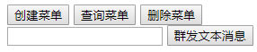
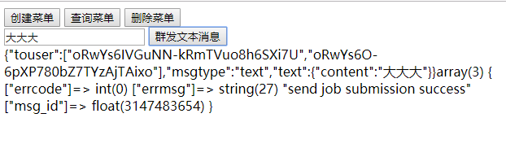
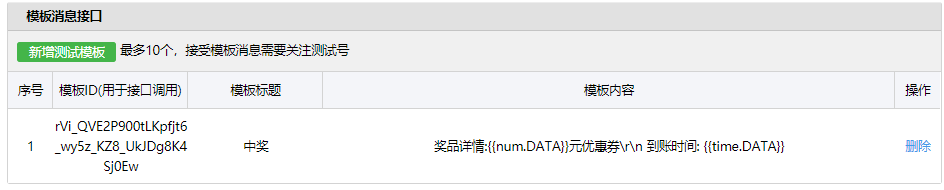
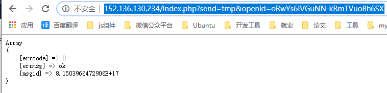
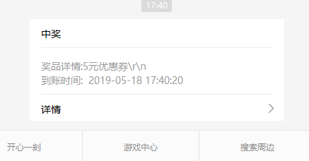

## 1  代码重构

>  上一阶段的代码已经涉及到了很多模块，包括微信验证、消息回复、mysql和memcache等，从本阶段起还会继续添加公众号主动发送消息等模块，因此，在开始之前，我们有必要将wx_sample12.php重构一遍。遵从一个入口原则，我们需要一个微信入口文件index.php以及多个封装各个模块的类，重构后的wx_sample12.php分为index.php和inc文件夹中的多个文件，最后，为了方便菜单操作，增加了admin文件夹，重构后的整个项目见weixin01文件夹


## 2  群发接口

### 2.1  根据openid群发文本消息

+ 获取所有粉丝openid

    ```php
    public function getAllUserOpenId(){
        $sql="select openid from users";
        $res=$this->mysql->sqlQuery($sql,true);
        $users = [];
        for ($i = 0; $i < count($res); $i++) {
            $users[]=$res[$i]['openid'];
        }
        return $users;
    }
    ```


+ 群发文本消息函数

    ```php
    public function sendText($text){
        $url="https://api.weixin.qq.com/cgi-bin/message/mass/send?access_token=".$this->getAccessToken();
    
        $users = $this->getAllUserOpenId();
        $data=[
            'touser' => $users,
            'msgtype' => 'text',
            'text' => ['content'=>$text],
        ];
        $json=json_encode($data,JSON_UNESCAPED_UNICODE);
        echo $json;
        return $this->curl->httpRequest($url,$json);
    }
    ```


+ 调用群发函数

    + 在admin页面新增功能

        

        ```html
        <input type="text" id="text">
        <button onclick="sendText()">群发文本消息</button>
        ```

    + 发送请求

        ```js
        function sendText() {
            var text = document.getElementById('text').value;
            if(text == ''){
                alert('请输入要发送的文本消息');
                return;
            }
            $.get('../index.php',{
                send: 'text',
                text: text
            },function(data){
                $('#res').html(data);
            });
        }
        ```

    + index.php接收请求

        ```php
        if (@$_GET['send']) {
            // 微信菜单创建/查询/删除
            switch ($_GET['send']) {
                case 'text':
                    $arr = $wechatObj->sendText($_GET['text']);
                    var_dump($arr);
                    break;
        
               # code···
                default:
                    echo '没有该操作';
            }
            exit;
        }
        ```

    + 群发成功

    

### 2.2  根据openid群发其他消息消息

略（微信的需要media_id的接口坑得一匹）


## 3  发送模板消息

### 3.1  新增测试模板



 

### 3.2  处理请求

```php

if (@$_GET['send']) {
    switch ($_GET['send']) {
        # code···
        case 'tmp':
            $arr = [
                'num' => 5
            ];
            $arr = $wechatObj->sendTmp($_GET['openid'],$_GET['tmp_id'],$arr);
            echo "<pre>";
            print_r($arr);
            break;
        default:
            echo '没有该操作';
    }
    exit;
}
```

### 3.3  测试

测试链接demo：<http://152.136.130.234/index.php?send=tmp&openid=oRwYs6IVGuNN-kRmTVuo8h6SXi7U&tmp_id=rVi_QVE2P900tLKpfjt6_wy5z_KZ8_UkJDg8K4Sj0Ew>

测试结果：






完整项目代码见weixin02文件夹


